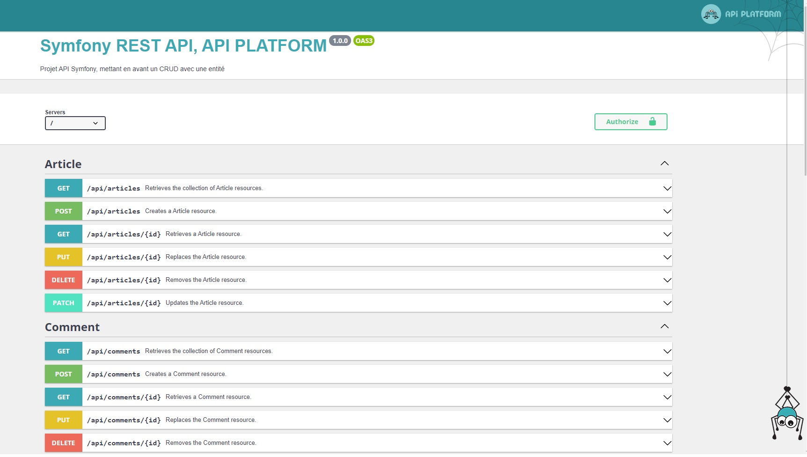

[![LinkedIn][linkedin-shield]][linkedin-url]


<!-- PROJECT LOGO -->
<br />
<p align="center">
  <h3 align="center">API REST, CRUD, Symfony 5, API PLATFORM</h3>

  <p align="center">
    Petit projet API, mettant en avant un CRUD avec Api Platform
    <br />
    <a href="https://github.com/herival"><strong>Herival</strong></a>
    <br />
  </p>
</p>


<!-- TABLE OF CONTENTS -->
<details open="open">
  <summary>Table des matières</summary>
  <ol>
    <li>
      <a href="#a-propos">A propos</a>
    </li>
    <li>
      <a href="#pre-requis">Pre-requis</a>
    </li>
    <li>
      <a href="#installation">Installation</a>
    </li>

  </ol>
</details>


<!-- ABOUT THE PROJECT -->
## A propos



Bonjour, c'est un API REST pour gérer une entité via un CRUD, dans symfony 5 et Api Plateforme.

## Pre-requis

L'application est faite avec les composants suivants: 
* [Composer](https://getcomposer.org/)
* [Symfony cli](https://symfony.com/)
* [Api Platform](https://api-platform.com/)
* [MySql](https://www.mysql.com/)
* [Postman](https://www.mysql.com/) (facultatif)


<!-- GETTING STARTED -->
## Installation

1. Cloner le repo
   ```sh
   git clone https://github.com/herival/Sf5-rest-api.git
   ```
2. Entrer dans le dossier du projet
   ```sh
   cd Sf5-rest-api
   ```
3. Installer les dépendances
   ```sh
   composer install
   ```
4. Créer la base de données
   ```sh
   php bin/console d:d:c
   ```
4. Appliquer les migrations
   ```sh
   php bin/console d:m:m
   ```
4. Lancer le serveur symfony
   ```sh
   symfony serve
   ```


[linkedin-shield]: https://img.shields.io/badge/-LinkedIn-black.svg?style=for-the-badge&logo=linkedin&colorB=555
[linkedin-url]: https://www.linkedin.com/in/herimalala-valisoa-05414184/

